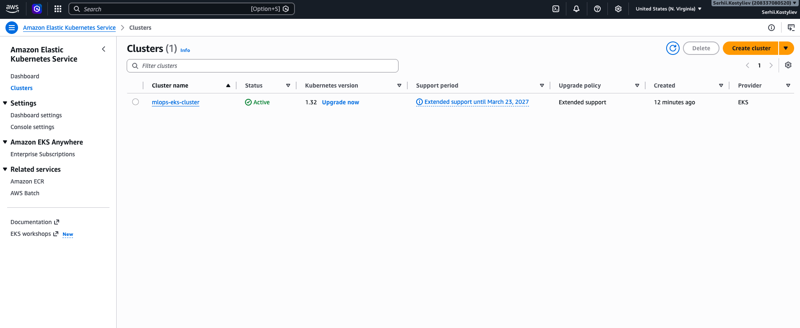
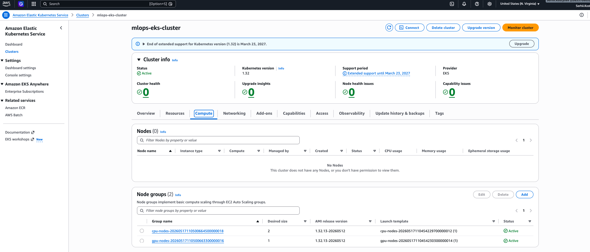
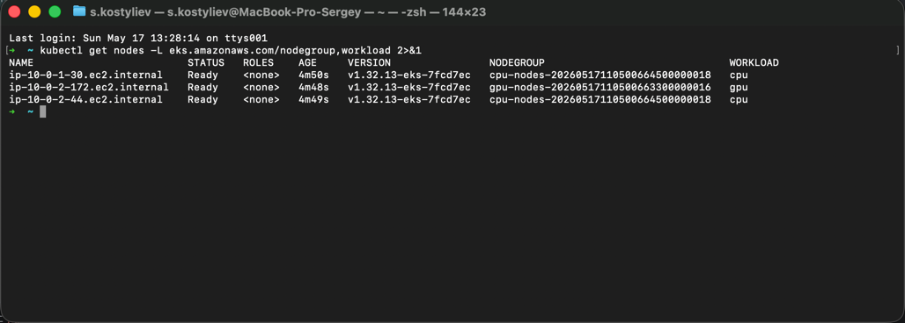

# EKS + VPC Infrastructure

Terraform-проєкт для розгортання VPC та EKS-кластера в AWS (us-east-1).

## Результат

### EKS кластер — Active



### Node Groups (cpu-nodes + gpu-nodes)



### kubectl get nodes



---

## Структура

```
eks-vpc-cluster/
├── bootstrap/   # Створює S3 bucket для Terraform state (запускається один раз)
├── vpc/         # VPC з публічними та приватними сабнетами
├── eks/         # EKS-кластер з двома node group-ами (cpu-nodes, gpu-nodes)
├── main.tf      # Кореневий модуль — імпортує vpc і eks
├── backend.hcl  # Назва S3 bucket (заповнюється після bootstrap)
└── screenshots/ # Скріншоти результатів
```

## Вимоги

- Docker (terraform запускається в контейнері)
- AWS CLI (локально)
- kubectl (локально)
- Налаштований AWS профіль (`~/.aws/credentials`)

## Покроковий запуск

### 1. Створення S3 bucket для Terraform state

```bash
docker compose run --rm terraform -chdir=bootstrap init
docker compose run --rm terraform -chdir=bootstrap apply -auto-approve
```

Скопіюй назву bucket з output `state_bucket` і встав у `backend.hcl`:

```hcl
bucket = "mlops-terraform-state-XXXXXXXX"
region = "us-east-1"
```

### 2. Застосування VPC

```bash
docker compose run --rm terraform -chdir=vpc init -backend-config=../backend.hcl
docker compose run --rm terraform -chdir=vpc apply
```

### 3. Застосування EKS

```bash
docker compose run --rm terraform -chdir=eks init -backend-config=../backend.hcl
docker compose run --rm terraform -chdir=eks apply -var="state_bucket=mlops-terraform-state-XXXXXXXX"
```

### 4. Підключення до кластера

```bash
aws eks --region us-east-1 update-kubeconfig --name mlops-eks-cluster
kubectl get nodes -L eks.amazonaws.com/nodegroup,workload
```

Ти маєш побачити 3 ноди: 2 з group `cpu-nodes` і 1 з `gpu-nodes`.

## Видалення ресурсів

Після перевірки — обов'язково видали все, щоб уникнути витрат:

```bash
# Спочатку EKS
docker compose run --rm terraform -chdir=eks destroy -var="state_bucket=mlops-terraform-state-XXXXXXXX"

# Потім VPC
docker compose run --rm terraform -chdir=vpc destroy

# S3 bucket можна залишити (коштує ~$0.02/міс за GB)
```

## Node Groups

| Group      | Instance  | Min | Max | Desired | Label         |
|------------|-----------|-----|-----|---------|---------------|
| cpu-nodes  | t3.micro  | 1   | 3   | 2       | workload=cpu  |
| gpu-nodes  | t3.micro  | 1   | 2   | 1       | workload=gpu  |


> Примітка: обидві групи використовують `t3.micro` (Free Tier). Реальні GPU-інстанси коштують сотні доларів на годину.
